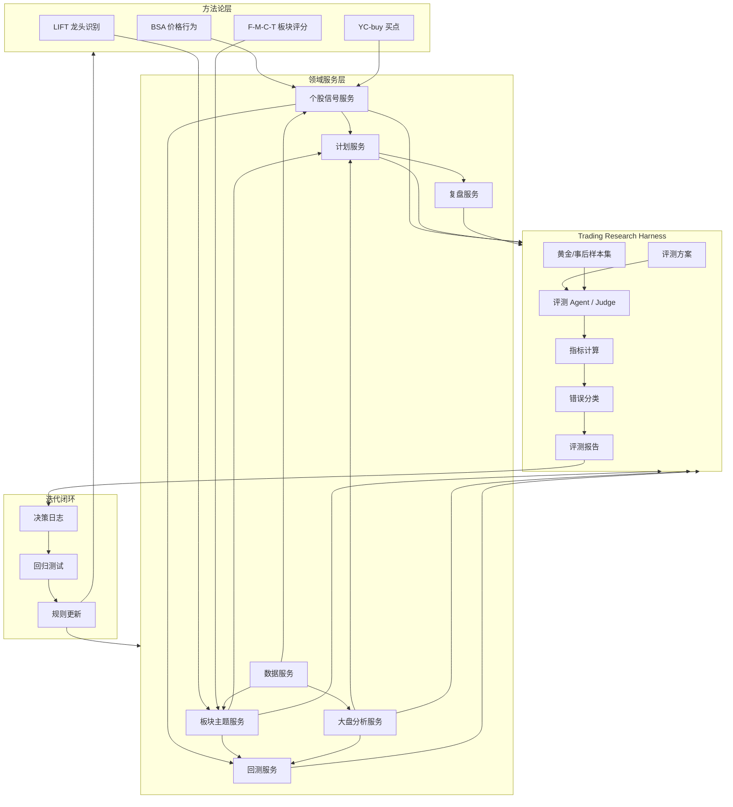

# Trading Research Harness

> 本文定义如何把当前交易研究系统转化为 Harness 式建设方式。
>
> Roadmap 解决“建什么系统”，Development Plan 解决“怎么开发”，Harness 解决“如何持续评测、验证和迭代每个能力”。

## 1. 为什么需要 Harness

交易系统最危险的不是没有规则，而是规则很多、每条听起来都合理，但没有稳定验证。

当前项目中已经有多套方法论和技能：

- 大盘分析
- 板块资金流
- LIFT 龙头识别
- BSA 价格行为
- YC-buy 买点
- 每日复盘
- 明日计划
- 观察池跟踪
- 回测系统

这些能力如果只靠“感觉好用”推进，很容易出现：

- 不同脚本评分口径不一致。
- 方法论被写成文字，但没有被验证。
- 复盘报告越来越多，但没有形成规则迭代。
- 买点有效性无法区分是市场环境带来的，还是策略本身带来的。
- Prompt 或规则改了一版，却不知道变好还是变差。

Harness 的目的就是建立一套持续验证框架：

```text
方法论
  -> 规则化
  -> 技能化
  -> 样本评测
  -> 回测验证
  -> 复盘归因
  -> 方法论升级
```

## 2. Harness 总体架构



## 3. Harness 分层

### 3.1 评测方案层

每个可评测能力都应有一份评测方案。

建议目录：

```text
docs/evals/
  market_regime_eval.md
  theme_strength_eval.md
  lift_leader_eval.md
  bsa_signal_eval.md
  yc_buy_signal_eval.md
  tomorrow_plan_eval.md
  daily_review_eval.md
  backtest_eval.md
```

每份方案至少包含：

- 能力定义
- 输入数据
- 输出 schema
- 评测指标
- 目标阈值
- 样本集要求
- 边界用例
- 错误分类
- 人工复核规则

### 3.2 样本集层

交易领域不能只依赖当下 ground truth，需要三类样本。

| 样本类型 | 含义 | 适用能力 |
|---|---|---|
| 静态样本 | 当下即可判断对错 | 数据格式、字段、JSON、代码映射 |
| 人工标注样本 | 需要人工基于方法论打标签 | BSA、LIFT、复盘质量 |
| 事后验证样本 | 需要观察次日或未来几日表现 | 明日计划、板块延续、买点有效性 |

建议目录：

```text
examples/evals/
  datasets/
    market_regime/
    theme_strength/
    lift_leader/
    bsa_signal/
    yc_buy_signal/
    tomorrow_plan/
    daily_review/
  results/
  reports/
```

### 3.3 Judge 层

Judge 可以是代码，也可以是专业 Agent。

使用原则：

- 格式、字段、数值、回测指标，用代码 judge。
- BSA、LIFT、复盘质量、计划清晰度，用专业 Agent judge。
- 关键结论需要人工抽检兜底。

建议目录：

```text
src/skill_lab/evaluation/
  schemas.py
  datasets.py
  judges.py
  metrics.py
  reports.py
  runner.py
```

### 3.4 指标层

指标分三层。

| 层级 | 指标类型 | 示例 |
|---|---|---|
| L1 通用基础指标 | 所有能力都要看 | 输出格式合规率、字段完整率、异常率 |
| L2 能力类型指标 | 按能力选择 | 分类准确率、排序相关性、召回率、MAE |
| L3 专属指标 | 每个域自定义 | 龙头转移识别率、真假突破误判率、计划触发有效率 |

### 3.5 错误分类层

统一错误分类方便后续归因。

```text
FORMAT_ERROR        输出格式错误
MISSING_FIELD       缺字段
DATA_ERROR          数据源或字段映射错误
WRONG_REGIME        市场状态判断错误
WRONG_THEME         主题归类错误
WRONG_LEADER        龙头识别错误
WRONG_STRUCTURE     BSA 结构判断错误
FALSE_BREAKOUT_MISS 假突破风险漏判
BAD_ACTION          计划动作不合理
BAD_INVALIDATION    放弃条件不清楚
OVERCONFIDENT       结论过度确定
NO_EVIDENCE         证据不足
BACKTEST_MISMATCH   回测结果解析错误
```

## 4. 各领域 Harness 设计

| 域 | 是否需要 Harness | 主要评测方式 | 是否建议专业 Agent |
|---|---|---|---|
| 数据域 | 需要 | 代码检查、schema 校验 | 不建议 |
| 大盘分析 | 需要 | 规则评测 + 事后验证 | 可选 |
| 板块主题 | 需要 | 排序评测 + 事后验证 | 建议 |
| LIFT 龙头 | 强烈需要 | 人工样本 + 事后表现 | 强烈建议 |
| 个股 BSA | 强烈需要 | 专业 Judge + 人工抽检 | 强烈建议 |
| YC-buy | 需要 | 回测 + 规则过滤对比 | 可选 |
| 明日计划 | 强烈需要 | 事后触发与有效性 | 强烈建议 |
| 每日复盘 | 需要 | LLM-as-Judge + 人工抽检 | 建议 |
| 观察池 | 需要 | 状态流转准确性 | 不建议 |
| 回测 | 需要 | 指标、结果一致性 | 不建议 |

## 5. 是否每个域都要建专业 Agent

结论：不需要。

专业 Agent 的价值在于：

- 有复杂方法论。
- 需要解释和归因。
- 需要判断边界场景。
- 输出不是简单数值。
- 人类专家本来也会用一套隐性标准判断。

不适合 Agent 化的域：

- 数据拉取。
- 字段标准化。
- 数值计算。
- 回测指标计算。
- 文件读写。
- schema 校验。

这些应该用代码服务，Agent 只负责设计、解释和复盘。

## 6. 推荐专业 Agent 划分

### 6.1 必建 Agent

| Agent | 对应域 | 职责 |
|---|---|---|
| `MarketRegimeJudge` | 大盘分析 | 判断市场状态是否合理，解释证据是否充分 |
| `ThemeStrengthJudge` | 板块主题 | 评估主题评分、主线判断、证据链 |
| `LiftLeaderJudge` | 龙头识别 | 判断候选是否真有龙头地位 |
| `BsaSignalJudge` | 个股结构 | 判断背景、结构、行动、真假突破 |
| `TomorrowPlanJudge` | 明日计划 | 判断计划是否可执行、可验证、有放弃条件 |
| `DailyReviewJudge` | 每日复盘 | 判断复盘是否覆盖关键事实和归因 |

### 6.2 可选 Agent

| Agent | 对应域 | 是否现在做 |
|---|---|---|
| `YcBuySignalJudge` | 买点信号解释 | P1 后做 |
| `WatchlistJudge` | 观察池状态 | P2 后做 |
| `BacktestReportJudge` | 回测报告解释 | P2 后做 |
| `MethodologyRefiner` | 方法论迭代 | P2 后做 |

### 6.3 不建议 Agent 化

| 域 | 原因 |
|---|---|
| DataProvider | 应该稳定、确定、可测试 |
| Normalizer | 字段转换用代码更可靠 |
| Metrics | 数值指标必须精确 |
| BacktestEngine | 执行过程应确定可复现 |
| Serialization | 不需要语言判断 |

## 7. Agent 与服务的关系

Agent 不直接替代服务。

正确关系：

```text
服务负责计算
Agent 负责判断
Harness 负责评测
Journal 负责沉淀
Backtest 负责验证
```

示例：

```text
ThemeStrengthService 计算 F-M-C-T 分数
ThemeStrengthJudge 判断这个分数和证据链是否合理
Harness 记录判断结果和错误分类
Backtest 验证高分主题未来表现
Journal 沉淀规则调整建议
```

## 8. 专业 Agent Prompt 模板

```text
你是 {domain} 的专业评测 Agent。

你的任务不是给投资建议，而是评测系统输出是否符合方法论和证据标准。

输入包括：
- 原始数据
- 系统输出
- ground_truth 或事后表现
- 当前评测方案

请按以下流程评测：
1. 检查输出格式和字段完整性。
2. 检查证据是否支持结论。
3. 检查是否存在过度确定。
4. 检查确认条件和放弃条件是否明确。
5. 按 rubric 打分。
6. 给出错误分类。
7. 输出合法 JSON。

只输出 JSON，不输出额外解释。
```

## 9. Harness 输出 Schema

```json
{
  "sample_id": "string",
  "domain": "string",
  "target_version": "string",
  "judge_version": "string",
  "format_ok": true,
  "field_complete": true,
  "score": 0,
  "passed": false,
  "error_types": [],
  "evidence_quality": 0,
  "actionability": 0,
  "risk_control": 0,
  "notes": "string",
  "suggested_fix": "string"
}
```

## 10. 首批建设顺序

| 顺序 | 任务 | 优先级 |
|---:|---|---|
| 1 | 建 `src/skill_lab/evaluation/` 骨架 | P0 |
| 2 | 定义 Harness schema | P0 |
| 3 | 写 `tomorrow_plan_eval.md` | P0 |
| 4 | 写 `daily_review_eval.md` | P0 |
| 5 | 建明日计划样本集 | P0 |
| 6 | 建 `TomorrowPlanJudge` prompt | P0 |
| 7 | 建复盘样本集 | P1 |
| 8 | 建 `DailyReviewJudge` prompt | P1 |
| 9 | 建 LIFT/BSA 样本集 | P1 |
| 10 | 建 `LiftLeaderJudge` 和 `BsaSignalJudge` | P1 |
| 11 | 接入回测结果评测 | P2 |

## 11. 推荐最小可用版本

先不要一次性评测所有域。

最小版本只做两个能力：

```text
TomorrowPlan Harness
DailyReview Harness
```

因为这两个最接近日常闭环：

```text
今日复盘
  -> 明日计划
  -> 次日触发/失效
  -> 事后评价
  -> 改进规则
```

等这个闭环跑顺，再扩展到：

```text
ThemeStrength Harness
LIFT Harness
BSA Harness
YC-buy Backtest Harness
```

## 12. 与现有项目文档的关系

```text
TRADING_SYSTEM_ROADMAP.md
  -> 系统蓝图

TRADING_SYSTEM_DEVELOPMENT_PLAN.md
  -> 开发执行计划

TRADING_RESEARCH_HARNESS.md
  -> 评测、验证、迭代体系
```

