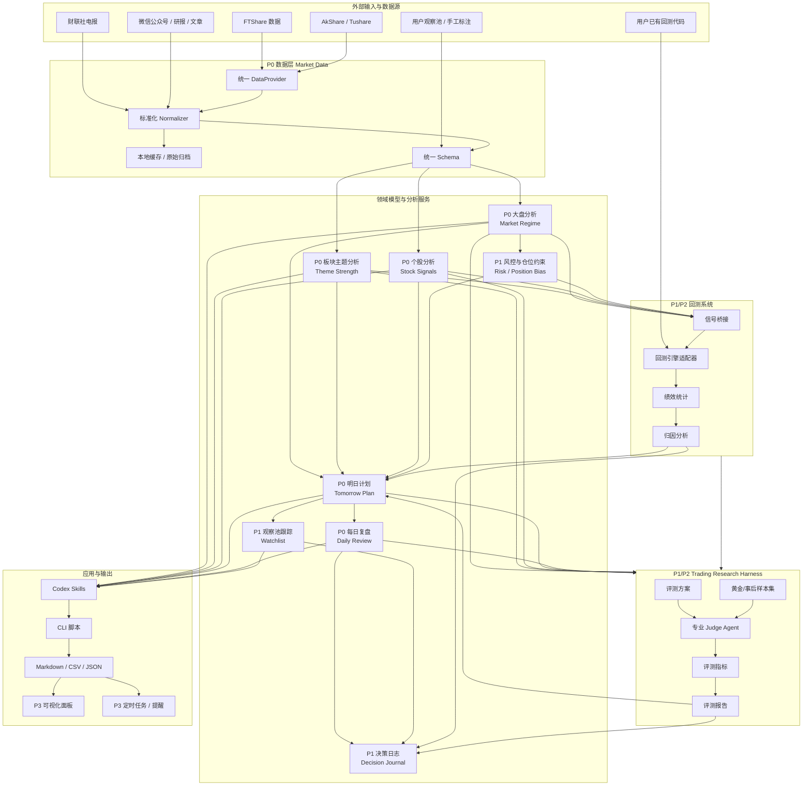

# Trading System Roadmap

> 本项目目标：把 `skills-engineering-workspace` 从一组 Codex Skills 与脚本，逐步建设成一套 A 股交易研究、计划、复盘与回测系统。
>
> 定位：研究与决策辅助系统，不是自动实盘交易系统。所有输出用于研究、复盘和计划，不构成投资建议。

## 1. 总体目标

系统最终应覆盖以下闭环：

```text
数据获取
  -> 大盘分析
  -> 板块/主题分析
  -> 个股分析
  -> 明日计划
  -> 观察池跟踪
  -> 每日复盘
  -> Harness 评测
  -> 回测验证
  -> 规则迭代
```

建设原则：

- `skills/` 保持为 Codex 触发入口和用户工作流入口。
- `src/skill_lab/` 承载稳定、可复用的领域模型和服务层。
- `sources/` 作为外部策略、回测代码、方法论和原始资料的摄入区。
- `examples/` 作为真实样例、手工回归和报告模板资产。
- `tests/` 逐步覆盖核心模型、数据适配、评分和回测结果。
- `docs/evals/` 和 `examples/evals/` 承载 Harness 评测方案、样本集、结果和报告。
- 回测、复盘、计划必须使用同一套信号与规则对象，避免各自维护一套逻辑。
- 方法论能力必须经过 Harness 评测、复盘归因或回测验证后，再升级为正式规则。

## 2. 项目整体建设图



## 3. 领域模型划分

### 3.1 数据域 Market Data

职责：

- 统一股票、指数、ETF、可转债、基金、宏观、新闻、涨停、龙虎榜等数据获取。
- 将不同来源的字段标准化。
- 为上层分析提供稳定对象，不输出交易观点。

核心对象：

- `Instrument`
- `Bar`
- `QuoteSnapshot`
- `MarketBreadth`
- `IndexSnapshot`
- `IndexEnvironment`
- `LimitUpEvent`
- `DragonTigerRecord`
- `NewsEvent`
- `DataSourceStatus`

建议目录：

```text
src/skill_lab/market_data/
  providers.py
  ftshare_provider.py
  akshare_provider.py
  tushare_provider.py
  normalizers.py
  cache.py
  symbols.py
```

优先级：

- P0：统一 OHLCV、股票代码、指数环境、市场宽度。
- P0：FTShare provider 作为主数据源。
- P1：AkShare / Tushare fallback。
- P1：数据缓存与原始响应归档。
- P2：数据质量检查、缺失值报告、交易日历服务。

扩展入口：

- 新增数据源时实现 `DataProvider` 协议。
- 新增资产类型时扩展 `InstrumentType`。
- 新增字段时先进入 `raw`，验证稳定后进入标准 schema。

### 3.2 大盘分析域 Market Analysis

职责：

- 判断市场状态、短线情绪、指数环境、风格偏好和仓位约束。

核心对象：

- `MarketRegime`
- `BreadthScore`
- `RiskAppetite`
- `StyleEnvironment`
- `PositionBias`
- `MarketConstraint`

建议目录：

```text
src/skill_lab/market_analysis/
  breadth.py
  index_environment.py
  regime.py
  style.py
  position.py
```

优先级：

- P0：市场宽度评分。
- P0：指数环境分类。
- P0：进攻、结构修复、震荡、防守四类市场状态。
- P1：风格强弱，如大票、小票、科技、周期、消费。
- P1：仓位约束模型。
- P2：盘中状态更新。

扩展入口：

- 新增市场状态只扩展 `MarketRegime` 枚举和评分规则。
- 新增指数只接入 `IndexEnvironmentService`。

### 3.3 板块主题域 Sector / Theme Analysis

职责：

- 把新闻、涨停、龙虎榜、资金流、指数风格映射为主题强度和明日方向。

核心对象：

- `Theme`
- `ThemeCatalyst`
- `ThemeScore`
- `LeaderCandidate`
- `RotationState`
- `ThemePlan`

建议目录：

```text
src/skill_lab/sector_analysis/
  theme.py
  catalysts.py
  strength.py
  leaders.py
  rotation.py
  reports.py
```

优先级：

- P0：复用当前 F-M-C-T 评分。
- P0：输出主题优先级、确认条件、放弃条件。
- P1：识别板块核心、容量核心、补涨前排、风险样本。
- P1：主题生命周期：启动、发酵、主升、分歧、修复、退潮。
- P2：主题知识库与关键词可配置。

扩展入口：

- 新主题通过 `theme_registry.yml` 或 CSV 配置。
- 新评分因子以 `ThemeFactor` 插件方式注册。
- 新闻来源只产生 `ThemeCatalyst`，不直接改评分结论。

### 3.4 个股分析域 Stock Analysis

职责：

- 对单股进行技术、趋势、买点、板块角色和风险判断。

核心对象：

- `StockProfile`
- `TechnicalSignal`
- `BuyPointSignal`
- `TripleScreenSignal`
- `StockScore`
- `StockScenario`
- `InvalidationRule`

建议目录：

```text
src/skill_lab/stock_analysis/
  profile.py
  technical.py
  yc_buy_adapter.py
  triple_screen.py
  scoring.py
  scenarios.py
  reports.py
```

优先级：

- P0：接入 YC-buy，使用统一 OHLCV。
- P0：输出买点、趋势方向、等待/买入/放弃状态。
- P1：结合板块角色：龙头、容量、补涨、后排、风险样本。
- P1：关键位、触发位、失效位。
- P2：更多策略模型接入。

扩展入口：

- 新策略实现 `SignalEngine` 协议。
- 策略输出统一转成 `StockSignal`。
- 不同策略只负责发信号，不直接生成最终交易计划。

### 3.5 计划与复盘域 Planning / Review

职责：

- 把大盘、板块、个股信号组合成每日复盘和明日计划。
- 记录可验证的假设，而不是只生成观点文字。

核心对象：

- `DailyReview`
- `TomorrowPlan`
- `Scenario`
- `ActionLevel`
- `ConfirmationRule`
- `GiveUpRule`
- `ReviewFinding`

建议目录：

```text
src/skill_lab/planning/
  daily_review.py
  tomorrow_plan.py
  scenarios.py
  action_rules.py
  renderers.py
```

优先级：

- P0：把当前 `generate_daily_review.py` 的核心逻辑下沉。
- P0：生成明日方向清单、攻击标的池、确认/放弃条件。
- P1：计划与次日实际表现对比。
- P1：复盘归因：判断错、执行错、数据不足、规则失效。
- P2：周复盘、月复盘。

扩展入口：

- 新报告模板放在 `renderers.py` 或 `templates/`。
- 新计划类型通过 `PlanType` 扩展，如短线、趋势、低吸、ETF。

### 3.6 观察池与决策日志域 Tracking / Journal

职责：

- 维护长中短周期观察对象。
- 记录计划、执行、结果、偏差和复盘结论。

核心对象：

- `WatchItem`
- `WatchHorizon`
- `WatchStatus`
- `Trigger`
- `NextCheck`
- `DecisionJournal`
- `ExecutionRecord`

建议目录：

```text
src/skill_lab/tracking/
  watchlist.py
  horizons.py
  rules.py
  journal.py
  reports.py
```

优先级：

- P1：稳定 watchlist schema。
- P1：把明日计划自动写入观察池候选。
- P1：失效条件触发后自动标记。
- P2：决策日志和复盘归因联动。
- P3：提醒和定时检查。

扩展入口：

- 新观察对象类型扩展 `WatchItemType`。
- 新周期扩展 `WatchHorizon`。
- 新提醒方式不进入领域层，只做应用层适配。

### 3.7 回测域 Backtesting

职责：

- 使用同一套数据和信号对象验证策略有效性。
- 将回测结果反哺评分、计划和复盘。

核心对象：

- `BacktestConfig`
- `SignalEvent`
- `OrderEvent`
- `Trade`
- `Position`
- `EquityCurve`
- `PerformanceReport`
- `AttributionReport`

建议目录：

```text
src/skill_lab/backtesting/
  config.py
  signal_bridge.py
  engine_adapter.py
  result_schema.py
  metrics.py
  attribution.py
  reports.py
```

优先级：

- P1：把你的已有回测代码放入 `sources/upstream-repos/`。
- P1：设计 `BacktestEngineAdapter`，先不重写原回测引擎。
- P1：跑通 YC-buy 信号的基础回测。
- P2：加入大盘状态过滤、板块强度过滤。
- P2：按买点、板块、市场状态做归因。
- P3：参数寻优、组合回测、蒙特卡洛、组合风险。

扩展入口：

- 新回测引擎只实现 adapter。
- 新策略只输出标准 `SignalEvent`。
- 新绩效指标只扩展 `metrics.py`。

### 3.8 Harness 评测域 Evaluation

职责：

- 持续评测每个交易研究能力是否稳定、可解释、可复现。
- 把方法论从“文字经验”转化为“可验证样本、指标、错误分类和改进建议”。
- 对计划、复盘、板块、龙头、BSA 信号等非纯数值能力建立专业 Judge。
- 将评测结论写入决策日志和规则迭代流程。

核心对象：

- `EvalPlan`
- `EvalDataset`
- `EvalSample`
- `EvalResult`
- `JudgeAgent`
- `ErrorTaxonomy`
- `EvalReport`

建议目录：

```text
src/skill_lab/evaluation/
  schemas.py
  datasets.py
  judges.py
  metrics.py
  reports.py
  runner.py

docs/evals/
  tomorrow_plan_eval.md
  daily_review_eval.md
  theme_strength_eval.md
  lift_leader_eval.md
  bsa_signal_eval.md

examples/evals/
  datasets/
  results/
  reports/
```

优先级：

- P1：先建设 `TomorrowPlan Harness` 和 `DailyReview Harness`。
- P1：定义通用错误分类，如格式错误、证据不足、计划不可执行、放弃条件不清楚。
- P1：建立明日计划事后验证样本集。
- P2：建立 LIFT、BSA、主题强度样本集。
- P2：接入回测结果评测与多版本对比。
- P3：自动跑批与可视化。

专业 Agent 建设原则：

- 数据、字段、数值、回测指标用代码评测，不建 Agent。
- 大盘、板块、LIFT、BSA、明日计划、每日复盘这类需要方法论判断的域，建立专业 Judge Agent。
- Agent 负责判断和归因，服务负责计算，回测负责验证。

## 4. 能力优先级矩阵

| 优先级 | 能力 | 当前状态 | 建设目标 | 建议落点 |
|---|---|---|---|---|
| P0 | 统一数据 schema | 缺失 | 让所有分析共用标准对象 | `src/skill_lab/shared/schemas.py` |
| P0 | FTShare 数据 provider | 已有 skill | 下沉为可复用 provider | `market_data/ftshare_provider.py` |
| P0 | OHLCV 标准化 | 分散 | 支持个股分析和回测 | `market_data/normalizers.py` |
| P0 | 市场宽度分析 | 已有脚本 | 模块化评分服务 | `market_analysis/breadth.py` |
| P0 | 指数环境分析 | 已有脚本 | 模块化指数风格判断 | `market_analysis/index_environment.py` |
| P0 | 板块 F-M-C-T 评分 | 已有脚本 | 独立主题强度服务 | `sector_analysis/strength.py` |
| P0 | 明日计划 | 已有脚本 | 输出结构化 `TomorrowPlan` | `planning/tomorrow_plan.py` |
| P0 | 每日复盘 | 已有脚本 | 输出结构化 `DailyReview` | `planning/daily_review.py` |
| P0 | YC-buy 接入 | 已有 wrapper | 使用统一数据输入 | `stock_analysis/yc_buy_adapter.py` |
| P1 | 观察池 schema | 初步存在 | 长中短周期稳定跟踪 | `tracking/watchlist.py` |
| P1 | 决策日志 | 缺失 | 计划、执行、复盘闭环 | `tracking/journal.py` |
| P1 | 回测 adapter | 缺失 | 接入用户已有回测代码 | `backtesting/engine_adapter.py` |
| P1 | 信号桥接 | 缺失 | 分析信号转回测事件 | `backtesting/signal_bridge.py` |
| P1 | 风控与仓位约束 | 初步文本 | 规则化仓位建议 | `market_analysis/position.py` |
| P1 | Trading Research Harness | 缺失 | 评测计划、复盘、板块、BSA 等能力 | `evaluation/` + `docs/evals/` |
| P1 | TomorrowPlan Judge | 缺失 | 评测明日计划是否可执行、可验证 | `docs/evals/tomorrow_plan_eval.md` |
| P1 | DailyReview Judge | 缺失 | 评测每日复盘覆盖度和归因质量 | `docs/evals/daily_review_eval.md` |
| P2 | 回测归因 | 缺失 | 按市场/板块/买点归因 | `backtesting/attribution.py` |
| P2 | LIFT/BSA Judge | 缺失 | 评测龙头识别与价格结构判断 | `docs/evals/lift_leader_eval.md` / `docs/evals/bsa_signal_eval.md` |
| P2 | 主题知识库 | 脚本内硬编码 | 可配置主题与关键词 | `sector_analysis/theme_registry.yml` |
| P2 | 周/月复盘 | 缺失 | 周期性归因总结 | `planning/periodic_review.py` |
| P2 | 数据质量检查 | 缺失 | 缺失、延迟、异常提示 | `market_data/quality.py` |
| P3 | 可视化面板 | 缺失 | 浏览计划、复盘、回测结果 | `apps/dashboard/` |
| P3 | 定时任务 | 缺失 | 盘前/盘后自动生成 | app automation |
| P3 | 实盘接口 | 不建议早做 | 仅在研究系统稳定后考虑 | `execution/` |

优先级定义：

- P0：系统地基和主工作流，必须先做。
- P1：形成闭环，开始产生复利。
- P2：增强验证、归因和可维护性。
- P3：体验、自动化和高级扩展。

## 5. 建设阶段路线

### 阶段 0：架构冻结与模型定义

目标：先统一语言和边界。

交付物：

- `docs/TRADING_SYSTEM_ROADMAP.md`
- `docs/TRADING_DOMAIN_MODEL.md`
- `src/skill_lab/shared/schemas.py`
- `src/skill_lab/shared/enums.py`

验收标准：

- 主要对象名称统一。
- 现有脚本输出字段能映射到 schema。
- 明确哪些逻辑保留在 skill，哪些下沉到 `src/skill_lab`。

### 阶段 1：数据地基

目标：统一数据获取和标准化。

交付物：

- `DataProvider` 协议。
- `FTShareProvider`。
- `OHLCV` 标准化。
- `MarketBreadth` 标准化。
- `IndexEnvironment` 标准化。
- 基础数据缓存目录约定。

验收标准：

- 个股 K 线可以通过统一接口获取。
- 市场宽度和指数环境可以通过统一对象传给分析服务。
- YC-buy 不再直接依赖自己的数据抓取作为主路径。

### 阶段 2：大盘、板块、个股分析服务化

目标：把现有脚本里的判断逻辑变成可复用服务。

交付物：

- `MarketRegimeService`
- `ThemeStrengthService`
- `StockSignalService`
- `TomorrowPlanService`
- `DailyReviewService`

验收标准：

- 现有 market-flow 和 daily-review 输出保持兼容。
- 评分逻辑可以被测试。
- Markdown 渲染与核心判断解耦。

### 阶段 3：观察池与计划闭环

目标：让明日计划进入观察池，让复盘反过来更新状态。

交付物：

- 稳定 watchlist schema。
- `DecisionJournal`。
- `PlanOutcome`。
- 次日计划结果归因。

验收标准：

- 每个计划方向都有确认条件和放弃条件。
- 次日能标记触发、失败、未触发。
- 能区分判断错误、执行错误、数据不足、规则不足。

### 阶段 4：回测系统接入

目标：把你的已有回测代码接进当前架构。

交付物：

- `sources/upstream-repos/<backtest-name>/`
- `BacktestEngineAdapter`
- `SignalBridge`
- `PerformanceReport`
- `AttributionReport`

验收标准：

- 可以回测 YC-buy 单独信号。
- 可以回测 `MarketRegime + ThemeStrength + StockSignal` 组合过滤。
- 可以输出收益、回撤、胜率、盈亏比、交易次数、暴露天数。
- 可以按市场状态、板块、买点归因。

### 阶段 5：Harness 评测闭环

目标：让系统能力可以被持续评测，而不是只靠主观感觉判断是否变好。

交付物：

- `docs/TRADING_RESEARCH_HARNESS.md`
- `src/skill_lab/evaluation/`
- `docs/evals/tomorrow_plan_eval.md`
- `docs/evals/daily_review_eval.md`
- `examples/evals/datasets/tomorrow_plan/`
- `examples/evals/datasets/daily_review/`
- `examples/evals/results/`
- `examples/evals/reports/`

验收标准：

- 可以对一份明日计划输出结构化评测 JSON。
- 可以对一份每日复盘输出质量评分、证据评分和错误分类。
- Harness 结果可以进入 `DecisionJournal`。
- 规则变更前后可以做版本对比。

### 阶段 6：自动化与产品化

目标：降低每日使用成本。

交付物：

- 盘前检查脚本。
- 盘后复盘脚本。
- 周复盘脚本。
- 可视化面板或报告索引页。
- 自动提醒入口。

验收标准：

- 一条命令可以生成完整盘后复盘。
- 一条命令可以生成明日计划和观察池更新。
- 回测结果能进入周复盘。

## 6. 推荐工作流

### 盘前

```text
读取昨日 TomorrowPlan
  -> 检查观察池
  -> 更新指数与重点标的
  -> 输出今日关注清单
```

### 盘中

```text
更新市场宽度 / 指数 / 主题 / 核心股
  -> 标记触发、失效、等待
  -> 必要时生成盘中提示
```

### 盘后

```text
采集涨跌停、龙虎榜、指数、宽度、新闻
  -> 生成 MarketRegime
  -> 生成 ThemeScore
  -> 生成 StockSignal
  -> 生成 DailyReview
  -> 生成 TomorrowPlan
  -> 更新 Watchlist
  -> 写入 Journal
```

### 周末

```text
汇总本周计划与结果
  -> 回测本周信号
  -> 统计错误类型
  -> 调整评分因子或规则权重
```

## 7. 文件与模块建设清单

### P0 文件

```text
docs/TRADING_DOMAIN_MODEL.md
src/skill_lab/shared/schemas.py
src/skill_lab/shared/enums.py
src/skill_lab/market_data/providers.py
src/skill_lab/market_data/ftshare_provider.py
src/skill_lab/market_data/normalizers.py
src/skill_lab/market_analysis/breadth.py
src/skill_lab/market_analysis/index_environment.py
src/skill_lab/market_analysis/regime.py
src/skill_lab/sector_analysis/strength.py
src/skill_lab/stock_analysis/yc_buy_adapter.py
src/skill_lab/planning/daily_review.py
src/skill_lab/planning/tomorrow_plan.py
```

### P1 文件

```text
src/skill_lab/tracking/watchlist.py
src/skill_lab/tracking/journal.py
src/skill_lab/backtesting/config.py
src/skill_lab/backtesting/signal_bridge.py
src/skill_lab/backtesting/engine_adapter.py
src/skill_lab/backtesting/result_schema.py
src/skill_lab/backtesting/metrics.py
```

### P2 文件

```text
src/skill_lab/sector_analysis/theme_registry.yml
src/skill_lab/sector_analysis/rotation.py
src/skill_lab/backtesting/attribution.py
src/skill_lab/market_data/quality.py
src/skill_lab/planning/periodic_review.py
```

### P3 文件

```text
apps/dashboard/
tools/run_daily_review.ps1
tools/run_pre_market.ps1
tools/run_weekly_review.ps1
```

## 8. 回测系统接入策略

你的已有回测代码建议先按外部源处理：

```text
sources/upstream-repos/<your-backtest-code>/
```

不要一开始重构它。先做适配器：

```text
src/skill_lab/backtesting/engine_adapter.py
```

适配器需要完成：

- 把标准 `Bar` 转成回测引擎需要的数据格式。
- 把 `StockSignal` / `ThemeScore` / `MarketRegime` 转成 `SignalEvent`。
- 把回测结果转成标准 `PerformanceReport`。
- 把交易明细转成标准 `Trade`。

第一批回测场景：

1. 单独回测 YC-buy 买点。
2. YC-buy + 大盘状态过滤。
3. YC-buy + 板块强度过滤。
4. YC-buy + 大盘状态 + 板块强度 + 风控。
5. 明日计划中的确认条件能否提升收益回撤比。

## 9. 扩展预留入口

### 新数据源

实现：

```text
src/skill_lab/market_data/<source>_provider.py
```

接入：

```text
DataProvider
```

### 新策略

实现：

```text
src/skill_lab/stock_analysis/<strategy>_adapter.py
```

输出：

```text
StockSignal
SignalEvent
```

### 新主题体系

配置：

```text
src/skill_lab/sector_analysis/theme_registry.yml
```

输出：

```text
Theme
ThemeCatalyst
ThemeScore
```

### 新报告

实现：

```text
src/skill_lab/planning/renderers.py
```

输出：

```text
Markdown
CSV
JSON
```

### 新回测引擎

实现：

```text
BacktestEngineAdapter
```

不要让策略直接依赖某个回测引擎。

### 实盘执行

暂不进入 P0-P2。未来如需要，可新增：

```text
src/skill_lab/execution/
  broker_adapter.py
  order_router.py
  risk_guard.py
```

实盘执行必须依赖独立风控，不复用研究系统中的文字计划作为直接下单依据。

## 10. 验收里程碑

### M1：系统地基可用

- 统一 schema 建好。
- FTShare provider 可用。
- 市场宽度、指数环境可标准化。
- 现有每日复盘仍可生成。

### M2：分析服务可用

- 大盘状态、板块强度、个股信号服务化。
- 明日计划输出结构化对象。
- Markdown 只是渲染结果。

### M3：计划闭环可用

- 明日计划进入观察池。
- 次日能更新触发与失效。
- 复盘能标记错误类型。

### M4：回测闭环可用

- YC-buy 信号可回测。
- 大盘/板块过滤可回测。
- 回测结果进入归因报告。

### M5：Harness 评测闭环可用

- 明日计划可被事后验证。
- 每日复盘可被 Judge 评测。
- LIFT/BSA 样本集开始沉淀。
- 规则变更有评测报告依据。

### M6：日常工作流稳定

- 盘前、盘后、周末都有固定脚本。
- 报告稳定产出。
- 规则调整有回测和复盘依据。

## 11. 当前仓库到目标系统的迁移建议

当前仓库已有能力不需要推翻：

- `ftshare-market-data` 保留为数据 skill，逐步下沉 provider。
- `a-share-market-flow-analyst` 保留为大盘/板块/复盘 skill，逐步下沉分析服务。
- `yc-buy-selector` 保留为技术选股 skill，逐步改为消费统一 OHLCV。
- `watchlist-tracker` 保留为观察池入口，逐步升级 schema。
- `cls-telegraph-collector` 与 `wechat-official-collector` 保留为内容采集入口。

迁移顺序：

1. 先把公共读写、schema、枚举建起来。
2. 再移动纯计算逻辑。
3. 最后移动 CLI 和报告渲染。

不要一次性大重构。每次迁移都要求旧脚本仍能跑，输出尽量兼容。
